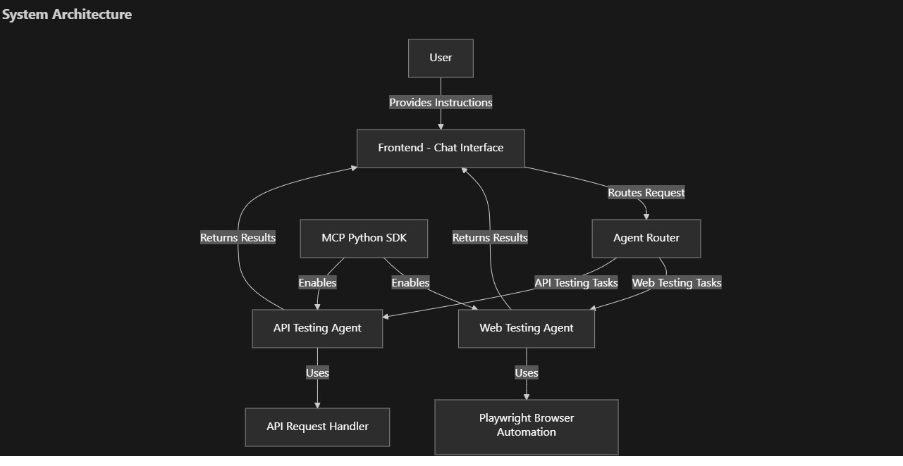

Multi-Agent Browser-Based Testing Application Plan
I'll outline a comprehensive plan for building your multi-agent application for web app and API testing using Playwright and the MCP Python SDK. This plan is designed with your basic experience level in mind and focuses on creating a simple chat interface where users can provide testing instructions.

System Architecture

img

Component Breakdown

1. Frontend (Simple Chat Interface)
   HTML/CSS/JavaScript-based chat interface
   Input area for user instructions
   Display area for agent responses and test results
   Visual indicators for test status (running, passed, failed)

2. Agent Router
   Analyzes user instructions to determine if it's a web testing or API testing task
   Routes the request to the appropriate agent
   Handles agent communication and response formatting

3. Web Testing Agent
   Processes natural language instructions for web testing
   Converts instructions into Playwright test scripts
   Executes tests and captures results (screenshots, logs, etc.)
   Provides detailed step-by-step reporting

4. API Testing Agent
   Processes API testing instructions
   Generates API test cases (including additional ones beyond what's specified)
   Validates responses, status codes, and data structures
   Provides comprehensive test reports

5. MCP Integration
   Uses MCP Python SDK for agent communication
   Implements tools for test execution and reporting
   Enables agents to share context and collaborate

Implementation Plan
Phase 1: Project Setup and Basic Structure
Set up project directory structure
Initialize frontend with basic HTML/CSS/JS
Set up Python backend with Flask/FastAPI
Install required dependencies (Playwright, MCP SDK, etc.)

Phase 2: Frontend Development
Design and implement chat interface
Create message handling system
Implement test result visualization
Add basic error handling and user feedback

Phase 3: Agent Router Implementation
Develop instruction parsing logic
Create routing mechanism
Implement response formatting
Add context management

Phase 4: Web Testing Agent
Implement natural language to Playwright script conversion
Create web testing execution engine
Develop screenshot and logging capabilities
Implement reporting mechanism

Phase 5: API Testing Agent
Develop API test case generation
Implement API request handling
Create response validation logic
Add intelligent test case expansion

Phase 6: MCP SDK Integration
Set up MCP server configuration
Implement agent tools and resources
Create shared context mechanisms
Enable inter-agent communication

Phase 7: Testing and Refinement
End-to-end testing of the system
Performance optimization
User experience improvements
Documentation

Technical Stack

img

Key Features

-- Web Testing Agent Capabilities --
Navigate to URLs
Fill out forms
Click buttons and links
Validate page content and UI elements
Handle authentication flows
Capture screenshots for visual verification
Execute complex test scenarios
Report detailed test steps and results

-- API Testing Agent Capabilities --
Send requests to endpoints (GET, POST, PUT, DELETE, etc.)
Set headers, query parameters, and request bodies
Validate response status codes
Verify response body content and structure
Check response times and performance
Generate additional test cases based on API schema
Test authentication and authorization
Provide comprehensive test reports

-- MCP Python SDK Integration --
The MCP Python SDK will be used to:

Create tools for executing Playwright commands
Provide resources for storing test results and screenshots
Enable natural language processing of test instructions
Facilitate communication between agents
Allow for context sharing and collaborative testing

Sample User Interactions
Web Testing Example:
User: "Test the login form at https://example.com/login. Try logging in with invalid credentials and verify the error message."

System: [Web Testing Agent]

1. Navigating to https://example.com/login
2. Identifying login form elements
3. Entering invalid credentials (username: "test", password: "wrongpassword")
4. Clicking submit button
5. Verifying error message: "Invalid username or password"
6. Test Result: PASSED - Error message displayed correctly
   [Screenshot attached]

API Testing Example:
User: "Test the user creation API at https://api.example.com/users with a POST request"

System: [API Testing Agent]

1. Sending POST request to https://api.example.com/users with sample user data
2. Response Status: 201 Created
3. Response Body: Valid JSON with user ID
4. Additional tests performed:
   - Verified required fields validation
   - Tested email format validation
   - Checked duplicate user handling
5. Test Results: 4/5 tests passed (See detailed report)
